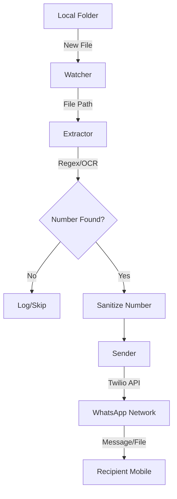

# WhatsApp File Dispatcher Architecture

## Overview
The application is a lightweight, cross-platform file processing agent designed to bridge local filesystem events with the WhatsApp messaging platform.

## System Components

### 1. Folder Watcher (`watcher.py`)
- **Technology**: Uses the `watchdog` library for OS-native event notification.
- **Role**: Monitors the configured `WATCH_FOLDER` for `on_created` events.

### 2. Information Extractor (`extractor.py`)
- **Core Logic**: Multi-stage data extraction.
  - **Stage 1: Filename Analysis**: Uses regex to identify phone numbers in the file name.
  - **Stage 2: Content Analysis**: 
    - **Plain Text**: Direct regex search.
    - **PDF**: Text extraction via `pypdf`.
    - **Word (DOCX)**: Parsing via `python-docx`.
    - **Images**: Optical Character Recognition (OCR) via `EasyOCR`.

### 3. Messaging Engine (`sender.py`)
- **Provider**: Twilio WhatsApp API.
- **Modes**:
  - **Mock Mode**: Logs actions when credentials are missing.
  - **Live Mode**: Dispatches messages via REST API.

## Data Flow Diagram

